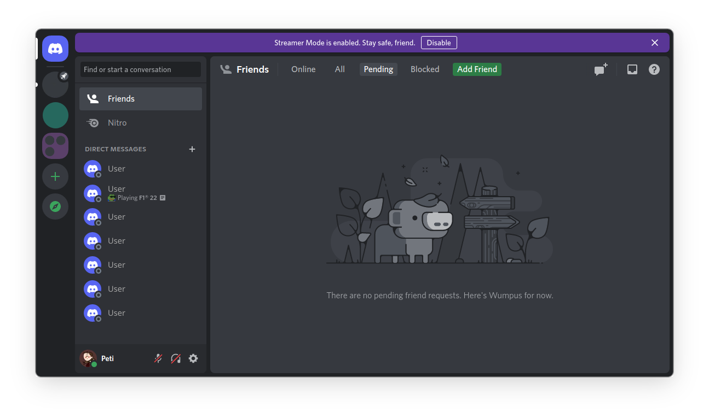

# DiscordRoundedCorner
### Discord theme for BetterDiscord with rounded corners

## How to use:
Disclaimer: you need to have [BetterDiscord](https://betterdiscord.app/) installed!

To install the theme, drag [RoundedCorners.theme.css](https://github.com/Peti253/DiscordRoundedCorner/blob/main/RoundedCorners.theme.css) into the themes folder.
if you don't know where the themes folder is, you can find it under `Settings` > `BetterDiscord` > `Themes`.
